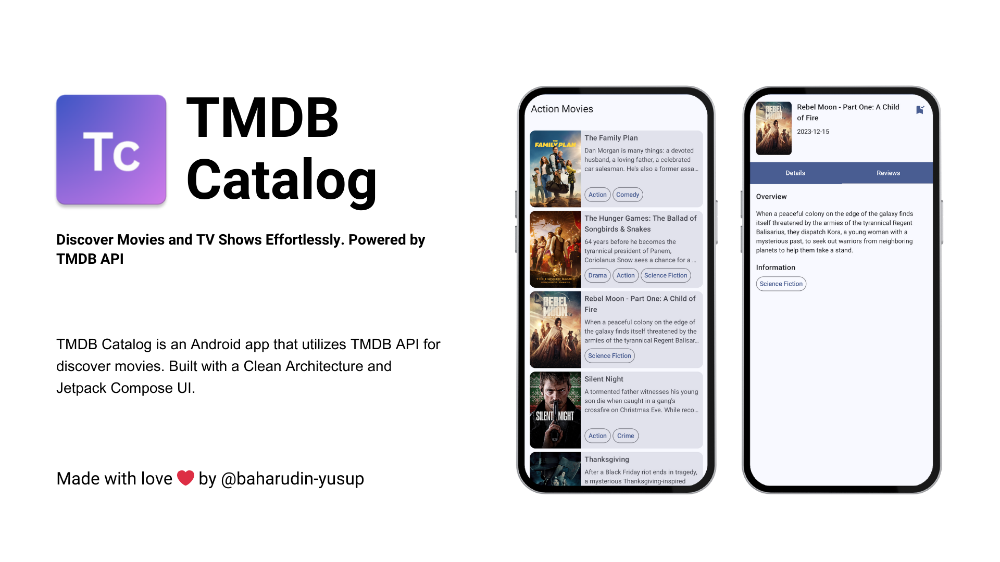

<a href='https://play.google.com/store/apps/details?id=dev.baharudin.tmdb_android&pcampaignid=pcampaignidMKT-Other-global-all-co-prtnr-py-PartBadge-Mar2515-1'></a>

# TMDB Catalog

[](https://github.com/baharudin-yusup/tmdb-android/actions/workflows/main_build_release.yml)


TMDB Catalog is an Android app that utilizes TMDB API for discover movies. Built with a Clean Architecture and Jetpack Compose UI.

### ⭐ Features

- Discover popular movies and TV shows.
- View details of individual movies and TV shows.
- Search for specific movies or TV shows.
- Mark movies or TV shows as favorites.

### ⚙️ Technologies

- Android Kotlin
- Clean Architecture
- Jetpack Compose UI
- GitHub Actions

### 📦 Dependencies

This app utilizes various libraries and frameworks for different functionalities such as navigation, network operations, coroutines, lifecycle management, dependency injection, paging, local database management, image loading, and basic UI elements.

You can find the complete list of dependencies and their usage in the `Dependencies.kt` file within the project.

## How to Set up?

To run the app, follow these steps:

1. Clone the repository:

   ```bash
   git clone https://github.com/baharudin-yusup/tmdb-android.git
   ```
2. Create a `local.properties` file in the root directory of the project and add your access tokens for development and production as follows:
   ```properties
   sdk.dir=your_sdk_dir
   DEV_ACCESS_TOKEN=your_dev_access_token_here
   PROD_ACCESS_TOKEN=your_prod_access_token_here
   ```
3. Create a `keystore.properties` file in the root directory of the project and add the following configuration to it:
   ```properties
   storePassword=your_store_password
   keyPassword=your_key_password
   keyAlias=your_key_alias
   storeFile=your/store/file_path.jdk
   ```
4. Open in Android Studio
5. Run the Application
